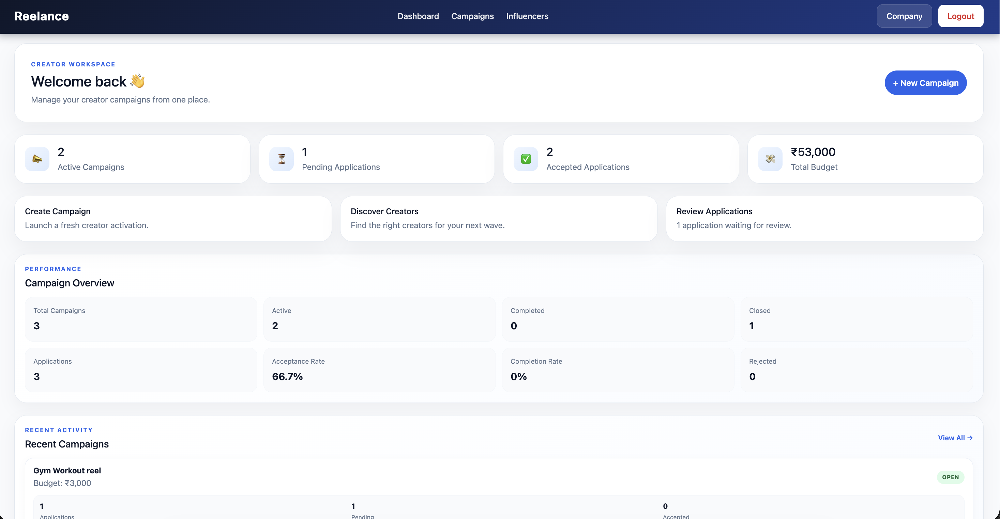
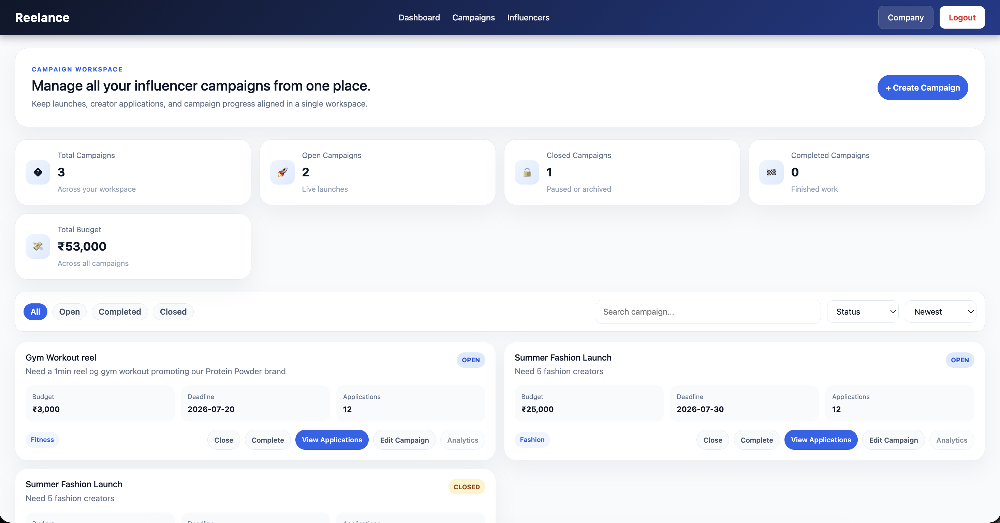
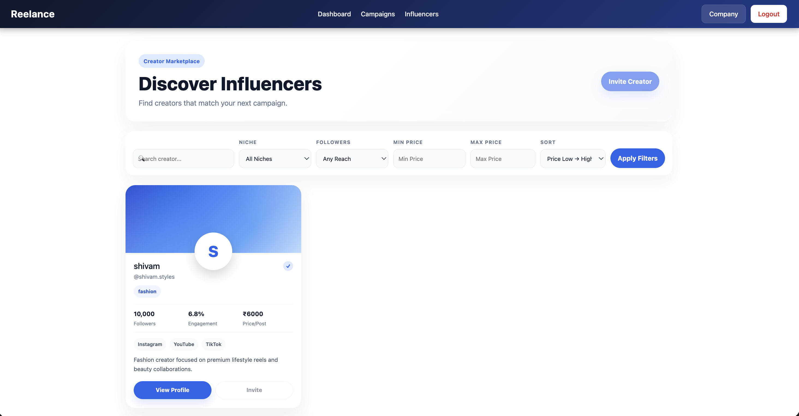
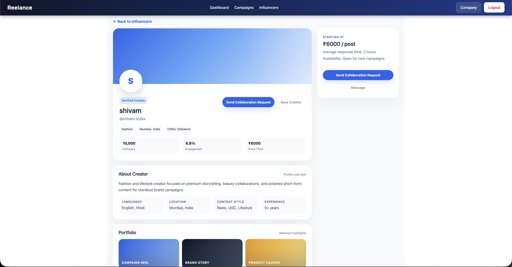
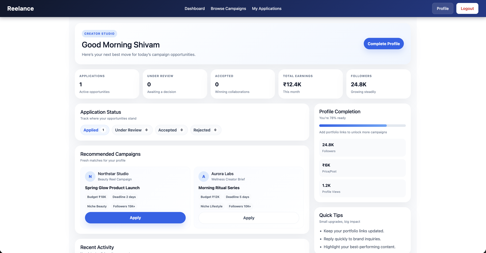
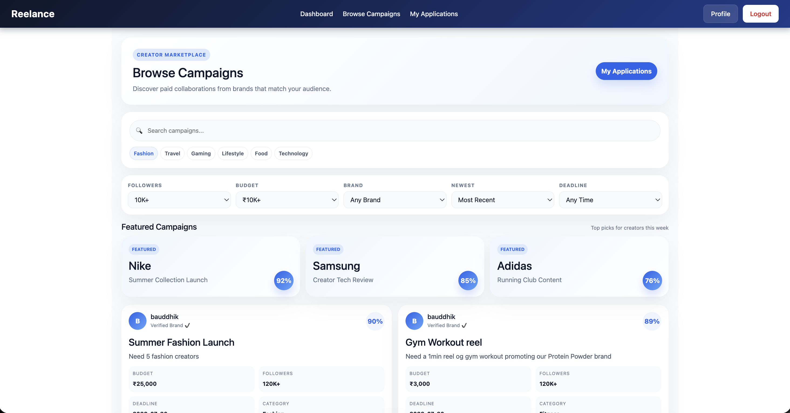
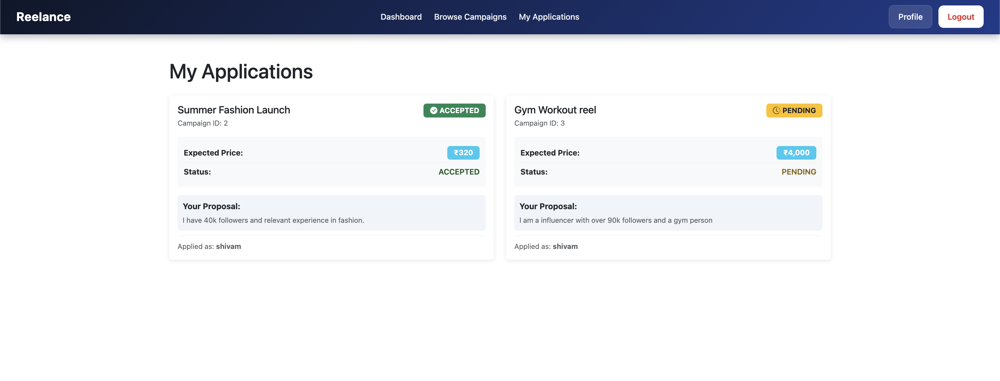

# Reelance

> Full-stack creator-brand collaboration platform built with Java, Spring Boot, Angular and PostgreSQL.

Reelance is a marketplace platform connecting **brands** and **influencers/creators** for campaign discovery, applications, collaboration, and campaign management.

The project is being developed as a real full-stack application rather than a static UI demo, with authenticated REST APIs, database persistence, role-based workflows, dynamic dashboards, search/filtering, and dedicated Brand and Influencer experiences.

---

## ✨ Highlights

- 🔐 JWT authentication and role-based authorization
- 🏢 Brand campaign management
- 🎥 Influencer campaign discovery
- 🔎 Creator search and filtering
- 📝 Campaign application workflow
- 👥 Campaign participant management
- 🤝 Brand–creator collaboration workflow
- 📊 Dynamic dashboard analytics
- 🔍 Campaign search, filtering, sorting and pagination
- 🧩 DTO-based REST API design
- ⚡ Database-level querying and aggregation
- 🛡️ Brand-level data isolation
- 🧭 Protected Angular routing
- 📱 Responsive Angular UI

---


## 🎯 What is Reelance?

Reelance provides two dedicated experiences within the same platform.

### 🏢 For Brands

Brands can:

- Create and manage campaigns

- Discover influencers and creators

- Search and filter creators

- View creator profiles

- Review campaign applications

- Accept or reject applications

- Track campaign participants

- Send collaboration requests

- Monitor campaign performance

- View dashboard analytics

- Manage company information

### 🎥 For Influencers

Creators can:

- Discover available campaigns

- Search and filter opportunities

- View campaign details

- Apply to campaigns

- Track application status

- Manage their creator profile

- View recommended campaigns

- Track profile performance

- Participate in accepted campaigns

---

# 🖥️ Application Preview

## 🏢 Brand Experience

### Brand Dashboard

A centralized workspace for campaign activity, applications and performance metrics.



### Campaign Management

Brands can manage campaigns, track budgets, deadlines and applications from a single workspace.



### Creator Discovery

Brands can search and filter creators based on niche, audience size, pricing and other profile attributes.



### Creator Profile

Brands can view detailed creator information before initiating a collaboration.



---

# 🎥 Influencer Experience

### Influencer Dashboard

Creators get a dedicated workspace for applications, opportunities, profile completion and earnings.



### Browse Campaigns

Creators can discover campaigns and filter opportunities based on their interests and audience.



### My Applications

Creators can track submitted applications and see whether campaigns are pending or accepted.



---

## 🏗️ Architecture

```text
┌─────────────────────────────────────────────────────┐
│                    Angular UI                       │
│                                                     │
│  Brand Workspace              Influencer Portal     │
│  ├─ Dashboard                 ├─ Dashboard          │
│  ├─ Campaigns                 ├─ Campaigns          │
│  ├─ Applications              ├─ Applications       │
│  ├─ Creator Discovery         ├─ My Campaigns       │
│  └─ Company Profile           └─ Profile Setup      │
└──────────────────────┬──────────────────────────────┘
                       │
                       │ HTTP / REST APIs
                       ▼
┌─────────────────────────────────────────────────────┐
│                 Spring Boot Backend                 │
│                                                     │
│  Controllers → Services → Repositories              │
│       │            │             │                  │
│       └────────────┴─────────────┘                  │
│                    DTOs                              │
│                    Security                          │
└──────────────────────┬──────────────────────────────┘
                       │
                       ▼
┌─────────────────────────────────────────────────────┐
│                    PostgreSQL                       │
└─────────────────────────────────────────────────────┘
```

### Backend request flow

```text
Angular Component
       ↓
Angular Service
       ↓
REST Controller
       ↓
Service Layer
       ↓
Repository
       ↓
PostgreSQL
```

DTOs are used between the API and application layers so that persistence entities are not directly exposed through API responses.

---

## 🛠️ Tech Stack

### Backend

| Technology | Purpose |
|---|---|
| Java | Backend language |
| Spring Boot | REST API framework |
| Spring Security | Authentication and authorization |
| JWT | Stateless authentication |
| Spring Data JPA | Persistence layer |
| Hibernate | ORM |
| PostgreSQL | Relational database |
| Gradle | Build and dependency management |
| Swagger / OpenAPI | API documentation |

### Frontend

| Technology | Purpose |
|---|---|
| Angular | Frontend framework |
| TypeScript | Application language |
| HTML / CSS | UI |
| Angular Router | Client-side routing |
| Angular HttpClient | API communication |
| Standalone Components | Angular application architecture |

---

## 🔐 Authentication & Authorization

Reelance uses JWT-based authentication with role-based access control.

Supported roles:

```text
USER
├── BRAND
└── INFLUENCER
```

Authentication flow:

```text
Login
  │
  ▼
Authentication API
  │
  ▼
JWT Token
  │
  ▼
Angular Client
  │
  ▼
Authorization Header
  │
  ▼
Spring Security
  │
  ▼
Protected REST API
```

Backend security components include:

- `SecurityConfig`
- `JwtAuthFilter`
- `JwtService`
- `CustomUserDetailsService`

Angular protected routes use an authentication guard.

---

## 🏢 Brand Workspace

The Brand experience is centered around campaign management and creator collaboration.

```text
Brand Dashboard
      │
      ├── Campaign Management
      │
      ├── Creator Discovery
      │
      ├── Application Management
      │
      ├── Campaign Participants
      │
      ├── Collaboration
      │
      └── Analytics
```

### Brand capabilities

- Create campaigns
- View campaigns
- Search and filter campaigns
- Close campaigns
- Complete campaigns
- View campaign applications
- Accept or reject applications
- View campaign participants
- Discover creators
- View creator profiles
- View campaign/application activity
- View dashboard metrics
- Manage company profile

---

## 🎥 Influencer Workspace

The Influencer experience focuses on discovering campaigns and participating in creator opportunities.

### Influencer capabilities

- Browse available campaigns
- View campaign details
- Apply to campaigns
- Track applications
- View accepted campaigns
- Manage influencer profile
- Complete profile setup
- Participate in campaigns
- Collaborate with brands

---

## 📣 Campaign Management

Campaigns contain information such as:

- Title
- Description
- Budget
- Niche
- Deadline
- Status
- Applications

Campaign statuses currently include:

```text
OPEN
CLOSED
COMPLETED
```

Campaign APIs support operations such as:

```text
Create Campaign
      ↓
View Campaign
      ↓
Receive Applications
      ↓
Close Campaign
      ↓
Complete Campaign
```

---

## 🔎 Campaign Workspace

The campaign workspace supports database-level search, filtering, sorting and pagination.

### Search

Search is supported across:

- Campaign title
- Campaign description

Search is case-insensitive and supports partial matches.

### Filters

Campaigns can be filtered by:

- Status
- Niche
- Minimum budget
- Maximum budget
- Deadline before
- Deadline after

### Sorting

Supported sorting fields include:

- `createdAt`
- `title`
- `budget`
- `deadline`
- `status`
- `niche`

Example:

```text
?sort=budget,desc
```

### Pagination

Example:

```text
?page=0&size=10&sort=createdAt,desc
```

Filters can be combined:

```text
/api/campaigns/brand/workspace
    ?search=summer
    &status=OPEN
    &niche=Fashion
    &budgetMin=10000
    &budgetMax=50000
    &sort=deadline,asc
    &page=0
    &size=20
```

Dynamic querying is implemented using Spring Data Specifications rather than creating separate endpoints for every filter combination.

---

## 👤 Influencer Discovery

Brands can discover creators through the influencer discovery workflow.

The application includes:

- Public creator search
- Influencer profiles
- Niche-based discovery
- Creator details
- Creator profile information
- Profile-specific routing

The backend includes a dedicated specification layer for dynamic influencer profile searching.

---

## 📝 Campaign Applications

Influencers can apply to campaigns.

Application lifecycle:

```text
             Apply
               │
               ▼
            PENDING
           /       \
          ▼         ▼
     ACCEPTED     REJECTED
          │
          ▼
     PARTICIPANT
```

Brands can review applications associated with their campaigns.

Application information includes:

- Application ID
- Campaign
- Influencer
- Status
- Creation timestamp

---

## 👥 Campaign Participants

Accepted applications can move into campaign participation.

The application keeps the concepts separate:

```text
CampaignApplication
        │
        │ accepted
        ▼
CampaignParticipant
```

Dedicated APIs are available for campaign participant workflows.

---

## 🤝 Collaboration

Reelance also contains a collaboration workflow for brand–creator interactions.

The backend includes:

- Collaboration requests
- Collaboration responses
- Collaboration status
- Collaboration status validation

This provides a foundation for extending the marketplace beyond campaign applications.

---

## ⭐ Reviews

A review workflow is also included in the backend.

Components include:

- Review requests
- Review responses
- Review service
- Review repository

This provides a foundation for reputation and feedback between participants in the marketplace.

---

## 📊 Brand Dashboard

The Brand dashboard is connected to backend data rather than relying on static values.

Current dashboard information includes:

- Active campaigns
- Pending applications
- Accepted applications
- Total campaign budget
- Recent campaigns
- Recent applications

Example:

```json
{
  "activeCampaigns": 2,
  "pendingApplications": 1,
  "acceptedApplications": 2,
  "totalBudget": 53000
}
```

The dashboard also supports navigation from summary cards into relevant Brand workflows.

---

## 📈 Dashboard Analytics

The backend analytics API provides metrics including:

- Total campaigns
- Active campaigns
- Completed campaigns
- Closed campaigns
- Total applications
- Pending applications
- Accepted applications
- Rejected applications
- Total budget
- Acceptance rate
- Completion rate

Example:

```json
{
  "totalCampaigns": 3,
  "activeCampaigns": 2,
  "completedCampaigns": 0,
  "closedCampaigns": 1,
  "totalApplications": 3,
  "pendingApplications": 1,
  "acceptedApplications": 2,
  "rejectedApplications": 0,
  "totalBudget": 53000,
  "acceptanceRate": 66.67,
  "completionRate": 0
}
```

---

## ⚡ Backend Structure

```text
com.reelance
│
├── config
│   ├── OpenAPIConfig
│   └── SecurityConfig
│
├── controller
│   ├── AuthController
│   ├── BrandController
│   ├── CampaignController
│   ├── CampaignApplicationController
│   ├── CampaignParticipantController
│   ├── CollaborationController
│   ├── DashboardController
│   ├── InfluencerController
│   ├── InfluencerProfileController
│   ├── InfluencerPublicController
│   ├── ReviewController
│   └── UserController
│
├── dto
├── entity
├── exception
├── repository
├── service
├── specification
└── util
```

---

## 🧩 Main Domain Model

```text
User
 │
 └── InfluencerProfile

Campaign
 │
 ├── CampaignApplication
 │       │
 │       └── Influencer
 │
 └── CampaignParticipant

CollaborationRequest

Review
```

Important domain enums include:

```text
Role
CampaignStatus
ApplicationStatus
CollaborationStatus
```

---

## 📦 DTO-Based API Design

The backend uses DTOs for API contracts.

### Authentication

```text
LoginRequest
RegisterRequest
AuthResponse
MeResponse
```

### Campaigns

```text
CampaignRequest
CampaignResponse
```

### Applications

```text
CampaignApplicationRequest
CampaignApplicationResponse
```

### Participants

```text
CampaignParticipantResponse
```

### Influencer Profiles

```text
InfluencerProfileRequest
InfluencerProfileResponse
```

### Collaboration

```text
CollaborationRequestDto
CollaborationResponse
```

### Reviews

```text
ReviewRequest
ReviewResponse
```

### Analytics

```text
BrandAnalyticsResponse
BrandDashboardResponse
```

---

## ⚙️ Dynamic Querying & Performance

The application uses database-level querying where appropriate.

### Spring Data Specifications

Dynamic campaign and influencer searches can combine multiple optional filters without requiring separate API endpoints.

### Pagination

Large result sets are paginated at the database/query layer.

### Aggregations

Dashboard metrics use database aggregation operations such as:

```text
COUNT
SUM
```

### N+1 Prevention

Fetch joins and optimized repository queries are used where appropriate when loading related application/campaign data.

### Lightweight Responses

List and dashboard APIs use dedicated DTOs rather than exposing JPA entities directly.

### Brand Isolation

Brand-specific data queries are scoped to the authenticated brand.

---

## 🖥️ Angular Structure

```text
src/app
│
├── auth
│   └── pages
│       ├── login
│       └── register
│
├── brand
│   ├── models
│   ├── pages
│   │   ├── campaigns
│   │   ├── dashboard
│   │   ├── applications
│   │   ├── campaign-applications
│   │   ├── campaign-participants
│   │   ├── influencers
│   │   ├── influencer-detail
│   │   └── company-profile
│   │
│   └── services
│
├── influencer
│   ├── models
│   ├── pages
│   │   ├── dashboard
│   │   ├── campaigns
│   │   ├── applications
│   │   ├── my-campaigns
│   │   └── profile-setup
│   │
│   └── services
│
├── core
├── pages
│   ├── profile
│   └── profile-edit
│
└── shared
    └── components
        └── navbar
```

The frontend uses Angular standalone components and lazy-loaded routes.

---

## 🔗 Frontend / Backend Integration

Example dashboard flow:

```text
Dashboard Component
        │
        ▼
BrandDashboardService
        │
        ▼
GET /api/brand/dashboard
        │
        ▼
BrandDashboardResponse
        │
        ▼
Angular UI
```

This separates API communication from presentation logic.

---

## 🧭 Application Routes

### Brand

```text
/brand/dashboard
/brand/campaigns
/brand/applications
/brand/influencers
/brand/influencers/:id
/brand/campaigns/:id/applications
/brand/campaigns/:id/participants
/brand/profile
```

### Influencer

```text
/influencer/dashboard
/influencer/campaigns
/influencer/applications
/influencer/my-campaigns
```

### Shared

```text
/login
/register
/profile
/profile/edit
/profile/setup
```

Protected routes use the Angular authentication guard.

---

## 📖 API Documentation

The backend includes OpenAPI/Swagger configuration.

Swagger UI provides a convenient way to explore:

- Available REST endpoints
- Authentication requirements
- Request DTOs
- Response DTOs
- API parameters

---

## 📁 Repository Structure

The implementation is maintained in two application repositories:

### Backend

`reelance-backend`

Java / Spring Boot REST API.

### Frontend

`reelance-ui`

Angular frontend application.

The implementation repositories may remain private while this repository acts as the public project showcase and technical documentation.

---

## 🧪 Local Development

### Backend

Clone the backend repository and configure the required PostgreSQL database and application properties.

Build:

```bash
./gradlew build
```

Run the Spring Boot application from Gradle or your IDE.

Default local API:

```text
http://localhost:8080
```

Swagger UI is available through the configured OpenAPI setup.

### Frontend

Install dependencies:

```bash
npm install
```

Start the Angular development server:

```bash
ng serve
```

Default local frontend:

```text
http://localhost:4200
```

The Angular application communicates with the local Spring Boot API.

---

## 🗺️ Development Roadmap

Reelance is actively being developed.

### Current focus

- Dynamic dashboard workflows
- Campaign workspace improvements
- Application management
- Creator discovery
- Campaign/application detail pages
- Dashboard analytics
- Dynamic routing
- UI refinement
- API integration
- Validation and error handling

### Future improvements

- Notifications
- Creator-brand messaging
- Payment integration
- Advanced campaign analytics
- Media/file management
- Cloud deployment
- Automated testing
- Observability and monitoring
- Production deployment

---

## 💡 Engineering Highlights

Reelance demonstrates full-stack engineering across:

### Backend

- Java
- Spring Boot
- Spring Security
- JWT
- Role-based authorization
- Spring Data JPA
- Hibernate
- PostgreSQL
- REST API design
- DTO architecture
- Dynamic Specifications
- Database aggregation
- Search
- Filtering
- Sorting
- Pagination
- N+1 query prevention

### Frontend

- Angular
- TypeScript
- Standalone components
- Angular Router
- Route guards
- HttpClient
- REST API integration
- Responsive UI
- Brand workflows
- Influencer workflows

---

## 📌 Project Status

**🚧 Active Development**

Reelance is being developed as a complete full-stack creator-brand marketplace.

The objective is to build a realistic application with:

```text
Authentication
      +
Authorization
      +
Database Persistence
      +
REST APIs
      +
Campaign Management
      +
Creator Discovery
      +
Applications
      +
Collaboration
      +
Analytics
      +
Responsive Angular UI
```

The project is continuously evolving as new backend capabilities and frontend workflows are implemented.

---

## 👨‍💻 Developer

### Shivam Sharma

**Java Full Stack Engineer**

Focused on building backend systems, REST APIs and full-stack applications using Java, Spring Boot, Angular and PostgreSQL.

### Core Technologies

```text
Java
Spring Boot
Spring Security
JWT
Spring Data JPA
Hibernate
PostgreSQL
Angular
TypeScript
REST APIs
Gradle
Git
GitHub
```

---

⭐ **Reelance is actively evolving — this repository documents the architecture, features and engineering work behind the platform.**
